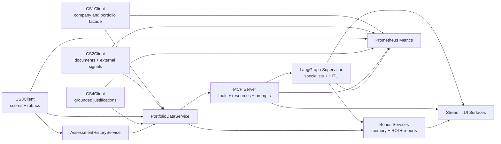

# DAMG7245 Case Study 5: Agentic Portfolio Intelligence

This repository contains the Case Study 5 submission for an agentic private-equity diligence platform built on top of the CS1-CS4 services. The repository has been normalized so the structure matches the implementation: there is one canonical application root, one canonical Streamlit UI entrypoint, one canonical Docker Compose file, and one canonical `exercises` location.

## What This Repository Includes

- `FastAPI` APIs for companies, evidence, scoring, search, and grounded justification workflows
- an `MCP` server exposing CS5 tools, resources, and prompts
- `LangGraph` specialists and a supervisor with HITL approval routing
- a unified `Streamlit` UI that embeds the full CS5 dashboard inside the broader platform console
- bonus deliverables for semantic memory, investment ROI tracking, IC memo generation, and LP letter generation
- `Snowflake`, `Redis`, and `Chroma` integration for persistence, caching, retrieval, and evidence-backed reasoning

## Architecture Overview

### Rendered Architecture Diagram


### Mermaid Component Diagram



For the fuller architecture narrative, data flow explanation, and persistence notes, see [pe-org-air-platform/docs/architecture.md](pe-org-air-platform/docs/architecture.md).

## Repository Structure

Top level:

- `README.md`
  Project overview, setup, runtime, and repository conventions.
- `docker-compose.yml`
  Canonical local Docker Compose entrypoint.
- `docker/`
  Canonical container build assets for the API and Airflow.
- `pyproject.toml`, `poetry.lock`
  Root dependency and packaging metadata.
- `pe-org-air-platform/`
  Canonical application root for source code, scripts, docs, tests, and outputs.

Inside `pe-org-air-platform/`:

- `app/`
  Core application code.
- `app/agents/`
  LangGraph state, specialists, supervisor, and runnable due-diligence orchestration.
- `app/dashboard/`
  Shared CS5 dashboard rendering components used by the main Streamlit UI.
- `app/mcp/`
  MCP server, tools, resources, prompts, ASGI surface, and client helpers.
- `app/services/`
  Integration clients, analytics, observability, value creation, and bonus extension services.
- `app/database/`
  Schema and persistence support.
- `streamlit/`
  The single user-facing Streamlit application entrypoint.
- `scripts/`
  Schema setup, indexing, scoring, MCP launch, and verification scripts.
- `exercises/`
  Coursework exercise entrypoints.
- `tests/`
  Unit, integration, and workflow validation tests.
- `docs/`
  Architecture, runbooks, and deployment documentation.
- `results/`
  Generated scoring outputs, portfolio artifacts, and bonus deliverables.

## Structural Notes

### Why `pe-org-air-platform` Is The Application Root

The application code intentionally lives under `pe-org-air-platform/`. The repository root is reserved for repo-level metadata and orchestration. That keeps source code, tests, scripts, docs, and generated artifacts in one bounded subtree instead of spreading runtime code across the whole repository.

### Why The Architecture File Previously Looked Like CS4

The repository previously still referenced a carried-over CS4 SVG asset. That has been corrected. The canonical architecture assets are now:

- `pe-org-air-platform/docs/architecture.md`
- `pe-org-air-platform/docs/assets/cs5-architecture.svg`

Both the file path and the visible diagram title now reflect Case Study 5.

### Why `exercises/` Previously Appeared In Two Places

The old root-level `exercises/complete_pipeline.py` file was only a forwarding wrapper around `pe-org-air-platform/exercises/complete_pipeline.py`. That duplicate wrapper has been removed. The only canonical exercise location is now:

- `pe-org-air-platform/exercises/`

### Why The Dashboard Previously Looked Separate

The repository used to carry a separate dashboard launcher even though the CS5 dashboard was already embedded in the main Streamlit app. That redundant launcher has been removed. The canonical UI entrypoint is now:

- `pe-org-air-platform/streamlit/app.py`

The CS5 dashboard itself is rendered from:

- `pe-org-air-platform/app/dashboard/view.py`

## Core Functional Areas

### Platform APIs

- `app/main.py` exposes the FastAPI app.
- `app/routers/` contains companies, evidence, scoring, search, and justification routes.
- `/metrics` is exposed for Prometheus-compatible observability.

### MCP Layer

- `app/mcp/server.py` registers the required CS5 tools plus bonus tools.
- `app/mcp/resources.py` exposes reusable scoring and sector resources.
- `app/mcp/prompts.py` exposes reusable diligence and reporting prompts.
- `app/mcp/asgi.py` exposes the HTTP MCP surface.

### Agentic Workflow

- `app/agents/state.py` defines workflow state.
- `app/agents/specialists.py` implements specialist agents.
- `app/agents/supervisor.py` manages routing and HITL approvals.
- `app/agents/run_due_diligence.py` and `exercises/agentic_due_diligence.py` provide runnable entrypoints.

### CS5 Dashboard And Bonus Features

The Streamlit UI now presents a portfolio-first experience with four primary work areas:

- `Home`
- `Portfolio Intelligence`
- `Diligence Workbench`
- `Advanced Ops`

Within `Portfolio Intelligence`, the integrated CS5 dashboard provides:

- EV-weighted Fund-AI-R portfolio metrics
- V^R / H^R scatter analysis
- company evidence and grounded justification drilldown
- Mem0-style semantic memory capture and recall
- investment tracker with ROI and MOIC
- IC memo generation
- LP letter generation

## Environment Configuration

Copy `pe-org-air-platform/.env.example` to `pe-org-air-platform/.env` and populate the required settings.

Required for realistic local execution:

- `SNOWFLAKE_ACCOUNT`
- `SNOWFLAKE_USER`
- `SNOWFLAKE_PASSWORD`
- `SNOWFLAKE_WAREHOUSE`
- `SNOWFLAKE_DATABASE`
- `REDIS_URL`
- `OPENAI_API_KEY` or `GEMINI_API_KEY`

Useful optional settings:

- `CS1_PORTFOLIOS_JSON`
  Local fallback for explicit portfolio holdings and enterprise values.
- `MCP_CLIENT_TRANSPORT`
- `MCP_SERVER_URL`
- `MCP_SERVER_COMMAND`
- `MCP_SERVER_ARGS`

## Installation

From the repository root:

```powershell
poetry install --with backend,dev
```

All local commands below assume you are using Poetry-managed dependencies from the repository root.

## Database Schema Setup

Apply the schema with:

```powershell
poetry run python pe-org-air-platform\scripts\apply_schema.py
```

This provisions the earlier case-study tables plus the CS5 persistence tables, including:

- `assessment_history_snapshots`
- `portfolios`
- `portfolio_holdings`

Portfolio membership preference order:

1. persisted `portfolios` and `portfolio_holdings` rows
2. `CS1_PORTFOLIOS_JSON`
3. local fallback estimates from configured portfolio tickers

The fallback path is suitable for development but should not be treated as the preferred production-style source.

## Running The Platform

### Start The FastAPI App

```powershell
poetry run python -m uvicorn app.main:app --app-dir pe-org-air-platform --reload
```

### Start The MCP Server Over HTTP

```powershell
poetry run python pe-org-air-platform\scripts\run_mcp_http.py
```

### Start The MCP Server Over Stdio

```powershell
poetry run python pe-org-air-platform\scripts\run_mcp_server.py
```

### Start The Unified Streamlit UI

```powershell
poetry run streamlit run pe-org-air-platform\streamlit\app.py
```

This is the single user-facing UI entrypoint. It includes the CS5 dashboard alongside the earlier case-study controls for scripts, APIs, retrieval, scoring, and results inspection.

The top-level navigation is intentionally curated:

- `Home` for executive summary and quick-start guidance
- `Portfolio Intelligence` for the CS5 dashboard, analytics, and company analysis
- `Diligence Workbench` for source checking and artifact review
- `Advanced Ops` for health checks, CRUD/API controls, scripts, scoring, and raw HTTP access

## Running The Exercises

### Agentic Due Diligence

```powershell
poetry run python pe-org-air-platform\exercises\agentic_due_diligence.py --company-id NVDA --assessment-type full
```

JSON output:

```powershell
poetry run python pe-org-air-platform\exercises\agentic_due_diligence.py --company-id NVDA --json
```

### Complete Pipeline

```powershell
poetry run python pe-org-air-platform\exercises\complete_pipeline.py --identifier NVDA --dimension data_infrastructure --json
```

## Verification And Tests

Run the full repository test suite:

```powershell
poetry run python -m pytest pe-org-air-platform\tests -q
```

Run the verification harness:

```powershell
poetry run python pe-org-air-platform\scripts\test_everything.py --skip-pytest --json
```

Useful focused slices:

```powershell
poetry run python -m pytest pe-org-air-platform\tests\test_mcp_server.py pe-org-air-platform\tests\test_mcp_integration.py pe-org-air-platform\tests\test_mcp_client.py pe-org-air-platform\tests\test_bonus_extensions.py -q
```

```powershell
poetry run python -m pytest pe-org-air-platform\tests\test_api.py pe-org-air-platform\tests\test_justifications_api.py pe-org-air-platform\tests\test_assessment_history.py pe-org-air-platform\tests\test_observability.py -q
```

## Docker And Local Services

The canonical Docker Compose file is the repository-root file:

- `docker-compose.yml`
- `docker/Dockerfile`
- `docker/airflow/docker-compose.airflow.yml`

Use it from the repository root:

```powershell
docker compose up --build
```

This starts the API container and Redis using paths that are correct relative to the repository root.

## Generated Outputs

Generated outputs are stored under `pe-org-air-platform/results/`.

Important locations:

- `results/PORTFOLIO/`
  Portfolio-level scoring runs and validation summaries.
- `results/<ticker>/`
  Company-specific outputs and evidence-backed artifacts.
- `results/bonus/documents/`
  IC memos and LP letters.
- `results/bonus/mem0_memory.json`
  Semantic memory records.
- `results/bonus/investment_tracker.json`
  ROI and investment tracking records.

## Key Documentation

- `pe-org-air-platform/docs/architecture.md`
- `pe-org-air-platform/docs/airflow_runbook.md`
- `pe-org-air-platform/DEPLOY_GCP_CLOUD_RUN.md`

## Repository Conventions

- The single Streamlit UI entrypoint is `pe-org-air-platform/streamlit/app.py`.
- The canonical exercise entrypoints live under `pe-org-air-platform/exercises/`.
- The canonical local container entrypoint is the root `docker-compose.yml`.
- The canonical API image build file is `docker/Dockerfile`.
- Temporary caches and scratch artifacts are ignored via `.gitignore` and should not be treated as source code.
