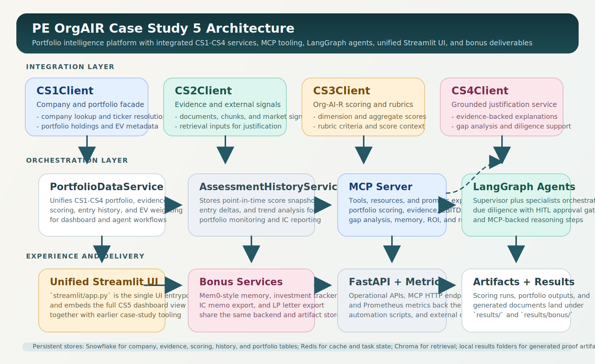
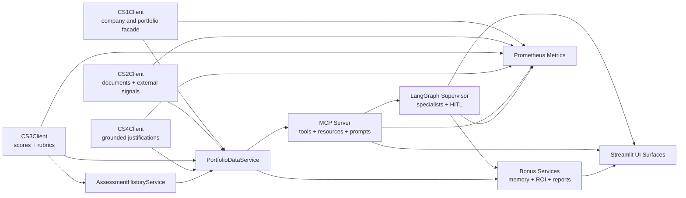

# DAMG7245 Case Study 5: Agentic Portfolio Intelligence

Course: DAMG 7245 - Big Data Systems & Intelligence Analytics  
Term: Spring 2026  
Instructor: Sri Krishnamurthy  
Program: MS in Information Systems, Northeastern University

## Team Members

- Ayush Patil
- Piyush Kunjilwar
- Raghavendra Prasath Sridhar

## Overview

This repository contains the Case Study 5 submission for an agentic private-equity diligence platform built on top of the CS1-CS4 services. The repository has been normalized so the structure matches the implementation: there is one canonical application root, one canonical Streamlit UI entrypoint, one canonical Docker Compose file, and one canonical `exercises` location.

Case Study 5 extends the earlier platform into an end-to-end `agentic portfolio intelligence` system. The project combines `FastAPI`, `Snowflake`, `Redis`, `Chroma`, `LangGraph`, and an `MCP` server to deliver evidence-backed company analysis, portfolio-level scoring, grounded justifications, agent-supervised due diligence, and bonus private-equity workflows such as semantic memory, ROI tracking, IC memo generation, and LP letter generation.

## Problem Statement

In private-equity and enterprise diligence workflows, portfolio intelligence systems must be:

- evidence-backed and auditable rather than prompt-only
- reusable across company-level and portfolio-level decisions
- able to combine structured scoring, retrieval, and narrative justification
- capable of safe agentic execution with explicit human approval on high-risk outputs
- deployable through APIs, dashboards, and interoperable tool surfaces

Static dashboards and one-off scripts are not enough for this workflow. CS5 addresses that gap by building a production-style agentic layer on top of the earlier case studies: `CS1` portfolio and company context, `CS2` evidence collection, `CS3` scoring, and `CS4` grounded justification. The result is a unified diligence platform that supports both direct user interaction and tool-driven agent orchestration.

## Objectives

- unify `CS1` through `CS4` behind a single application root and runtime model
- expose portfolio intelligence capabilities through `FastAPI`, `Streamlit`, and `MCP`
- support agentic due diligence with specialist routing and HITL approval thresholds
- provide portfolio-level analytics such as EV-weighted `Fund-AI-R` summaries
- add semantic memory, investment ROI tracking, IC memo generation, and LP letter generation
- preserve auditability through persisted scoring history, evidence retrieval, and reproducible outputs
- keep the repository structure canonical so setup, testing, and deployment are predictable

## Live Links

- Hosted UI: https://pe-org-ai-readiness.streamlit.app/
- Backend: https://org-air-api-334893558229.us-central1.run.app/
- Video Walkthrough: https://youtu.be/sQH2i6PgGE4
- Local Streamlit entrypoint: `pe-org-air-platform/streamlit/app.py`

## Codelabs Documentation

- Codelabs Preview: https://codelabs-preview.appspot.com/?file_id=1NeHLt3GEpjhhhg5ssUSpIOi80oyrqBBPEI-rd-uREnc#20

## Video Walkthrough

[](https://youtu.be/sQH2i6PgGE4)

## What This Repository Includes

- `FastAPI` APIs for companies, evidence, scoring, search, and grounded justification workflows
- an `MCP` server exposing CS5 tools, resources, and prompts
- `LangGraph` specialists and a supervisor with HITL approval routing
- a unified `Streamlit` UI that embeds the full CS5 dashboard inside the broader platform console
- bonus deliverables for semantic memory, investment ROI tracking, IC memo generation, and LP letter generation
- `Snowflake`, `Redis`, and `Chroma` integration for persistence, caching, retrieval, and evidence-backed reasoning

## Architecture Overview

### Rendered Architecture Diagram



### Mermaid Component Diagram



For the fuller architecture narrative, data flow explanation, and persistence notes, see [pe-org-air-platform/docs/architecture.md](pe-org-air-platform/docs/architecture.md).

## Core Workflow

```text
CS1 Company + Portfolio Context     CS2 Evidence + Signals
CS3 Scoring + Rubrics               CS4 Grounded Justifications
             \                         |                        /
              \                        |                       /
               +---- PortfolioDataService + History Layer ----+
                                  |
                                  v
                MCP Tools + Resources + Prompts
                                  |
                                  v
               LangGraph Supervisor + Specialist Agents
                                  |
                     +------------+------------+
                     |                         |
                     v                         v
             Streamlit Portfolio UI      Bonus Services
                                         Memory / ROI / IC / LP
```

## Key Design Decisions

### Canonical Application Root

All runtime code lives under `pe-org-air-platform/`. The repository root is reserved for repo metadata and orchestration. This avoids duplicated entrypoints and keeps source, tests, docs, scripts, and outputs in a single bounded subtree.

### Portfolio Membership Preference Order

Portfolio membership and enterprise value resolution follow a deterministic preference order:

1. persisted `portfolios` and `portfolio_holdings`
2. `CS1_PORTFOLIOS_JSON`
3. local fallback portfolio ticker configuration

This keeps local development practical while still preferring persisted data for portfolio analytics.

### Hybrid Retrieval For Grounded Justification

The retrieval layer combines `Chroma` semantic search with `BM25` lexical retrieval. That allows justifications to stay grounded in evidence even when the best match depends on either semantic similarity or direct keyword overlap.

### HITL Approval Thresholds

The agent supervisor requires human review for high-impact outputs, including very low or very high `Org-AI-R` scores and aggressive EBITDA projections. This keeps the agentic workflow useful without treating every generated result as automatically safe.

### Persisted Assessment History

Point-in-time scoring snapshots are stored in `assessment_history_snapshots`, allowing trend analysis, portfolio rollups, and artifact generation to use persisted historical context instead of ephemeral in-memory results.

### Unified Bonus Artifact Layer

Semantic memory, investment tracking, IC memos, and LP letters all write to a shared `results/bonus/` subtree. That keeps generated portfolio artifacts inspectable, reproducible, and easy to review outside the UI.

## Repository Structure

Top level:

- `README.md`
  Project overview, setup, runtime, and repository conventions.
- `docker-compose.yml`
  Canonical local Docker Compose entrypoint.
- `docker/`
  Canonical container build assets for the API and Airflow.
- `pyproject.toml`, `poetry.lock`
  Root dependency and packaging metadata.
- `pe-org-air-platform/`
  Canonical application root for source code, scripts, docs, tests, and outputs.

Inside `pe-org-air-platform/`:

- `app/`
  Core application code.
- `app/agents/`
  LangGraph state, specialists, supervisor, and runnable due-diligence orchestration.
- `app/dashboard/`
  Shared CS5 dashboard rendering components used by the main Streamlit UI.
- `app/mcp/`
  MCP server, tools, resources, prompts, ASGI surface, and client helpers.
- `app/services/`
  Integration clients, analytics, observability, value creation, and bonus extension services.
- `app/database/`
  Schema and persistence support.
- `streamlit/`
  The single user-facing Streamlit application entrypoint.
- `scripts/`
  Schema setup, indexing, scoring, MCP launch, and verification scripts.
- `exercises/`
  Coursework exercise entrypoints.
- `tests/`
  Unit, integration, and workflow validation tests.
- `docs/`
  Architecture, runbooks, and deployment documentation.
- `results/`
  Generated scoring outputs, portfolio artifacts, and bonus deliverables.

## Structural Notes

### Why `pe-org-air-platform` Is The Application Root

The application code intentionally lives under `pe-org-air-platform/`. The repository root is reserved for repo-level metadata and orchestration. That keeps source code, tests, scripts, docs, and generated artifacts in one bounded subtree instead of spreading runtime code across the whole repository.

### Why The Architecture File Previously Looked Like CS4

The repository previously still referenced a carried-over CS4 SVG asset. That has been corrected. The canonical architecture assets are now:

- `pe-org-air-platform/docs/architecture.md`
- `pe-org-air-platform/docs/assets/cs5-architecture.svg`

Both the file path and the visible diagram title now reflect Case Study 5.

### Why `exercises/` Previously Appeared In Two Places

The old root-level `exercises/complete_pipeline.py` file was only a forwarding wrapper around `pe-org-air-platform/exercises/complete_pipeline.py`. That duplicate wrapper has been removed. The only canonical exercise location is now:

- `pe-org-air-platform/exercises/`

### Why The Dashboard Previously Looked Separate

The repository used to carry a separate dashboard launcher even though the CS5 dashboard was already embedded in the main Streamlit app. That redundant launcher has been removed. The canonical UI entrypoint is now:

- `pe-org-air-platform/streamlit/app.py`

The CS5 dashboard itself is rendered from:

- `pe-org-air-platform/app/dashboard/view.py`

## Core Functional Areas

### Platform APIs

- `app/main.py` exposes the FastAPI app.
- `app/routers/` contains companies, evidence, scoring, search, and justification routes.
- `/metrics` is exposed for Prometheus-compatible observability.

### MCP Layer

- `app/mcp/server.py` registers the required CS5 tools plus bonus tools.
- `app/mcp/resources.py` exposes reusable scoring and sector resources.
- `app/mcp/prompts.py` exposes reusable diligence and reporting prompts.
- `app/mcp/asgi.py` exposes the HTTP MCP surface.

### Agentic Workflow

- `app/agents/state.py` defines workflow state.
- `app/agents/specialists.py` implements specialist agents.
- `app/agents/supervisor.py` manages routing and HITL approvals.
- `app/agents/run_due_diligence.py` and `exercises/agentic_due_diligence.py` provide runnable entrypoints.

### CS5 Dashboard And Bonus Features

The Streamlit UI presents six primary work areas:

- `Portfolio Overview`
- `Company Drilldown`
- `Assessment History`
- `Agentic Due Diligence`
- `Strategic Outputs`
- `MCP & Metrics`

Across these tabs, the integrated CS5 dashboard provides:

- EV-weighted Fund-AI-R portfolio metrics
- V^R / H^R scatter analysis
- company evidence and grounded justification drilldown
- Mem0-style semantic memory capture and recall
- investment tracker with ROI and MOIC
- IC memo generation
- LP letter generation

## Streamlit Application

The unified Streamlit application is the single user-facing interface for the repository. It embeds the CS5 dashboard inside the broader platform console and supports:

- executive portfolio summaries and EV-weighted analytics
- company drilldowns with evidence and justification review
- assessment history inspection
- agentic due-diligence runs
- semantic memory exploration
- investment ROI tracking
- IC memo and LP letter generation
- advanced operational controls for APIs, scripts, and metrics

## Environment Configuration

Copy `pe-org-air-platform/.env.example` to `pe-org-air-platform/.env` and populate the required settings.

Required for realistic local execution:

- `SNOWFLAKE_ACCOUNT`
- `SNOWFLAKE_USER`
- `SNOWFLAKE_PASSWORD`
- `SNOWFLAKE_WAREHOUSE`
- `SNOWFLAKE_DATABASE`
- `REDIS_URL`
- `OPENAI_API_KEY` or `GEMINI_API_KEY`

Useful optional settings:

- `API_BASE_URL`
  Backend base URL used by the Streamlit UI. Defaults to `http://127.0.0.1:8000`.
- `CS1_PORTFOLIOS_JSON`
  Local fallback for explicit portfolio holdings and enterprise values.
- `MCP_CLIENT_TRANSPORT`
- `MCP_SERVER_URL`
- `MCP_SERVER_COMMAND`
- `MCP_SERVER_ARGS`

## Installation

From the repository root:

```powershell
poetry install --with backend,dev
```

All local commands below assume you are using Poetry-managed dependencies from the repository root.

## Database Schema Setup

Apply the schema with:

```powershell
poetry run python pe-org-air-platform\scripts\apply_schema.py
```

This provisions the earlier case-study tables plus the CS5 persistence tables, including:

- `assessment_history_snapshots`
- `portfolios`
- `portfolio_holdings`

Portfolio membership preference order:

1. persisted `portfolios` and `portfolio_holdings` rows
2. `CS1_PORTFOLIOS_JSON`
3. local fallback estimates from configured portfolio tickers

The fallback path is suitable for development but should not be treated as the preferred production-style source.

## From-Scratch Bootstrap

If you are setting up the platform from an empty local environment, this is the highest-signal command order:

### 1. Install dependencies

```powershell
poetry install --with backend,dev
```

### 2. Configure environment variables

```powershell
Copy-Item pe-org-air-platform\.env.example pe-org-air-platform\.env
```

Populate `pe-org-air-platform/.env` with your `Snowflake`, `Redis`, and model-provider credentials.

### 3. Apply the database schema

```powershell
poetry run python pe-org-air-platform\scripts\apply_schema.py
```

### 4. Seed scoring configuration tables

```powershell
poetry run python pe-org-air-platform\scripts\seed_scoring_config.py
```

This seeds sector baselines, synergy rules, and talent penalty configuration used by the CS3 scoring engine.

### 5. Backfill the canonical company set

```powershell
poetry run python pe-org-air-platform\scripts\backfill_companies.py
```

### 6. Collect source evidence and external signals

```powershell
poetry run python pe-org-air-platform\scripts\collect_evidence.py --companies NVDA,JPM,WMT
```

```powershell
poetry run python pe-org-air-platform\scripts\collect_signals.py --companies NVDA,JPM,WMT
```

### 7. Compute signal summaries and company summaries

```powershell
poetry run python pe-org-air-platform\scripts\compute_signal_scores.py
```

```powershell
poetry run python pe-org-air-platform\scripts\compute_company_signal_summaries.py
```

### 8. Run scoring for the selected company set

```powershell
poetry run python pe-org-air-platform\scripts\run_scoring_engine.py --batch --tickers NVDA,JPM,WMT
```

### 9. Validate the resulting portfolio outputs

```powershell
poetry run python pe-org-air-platform\scripts\validate_portfolio_scores.py
```

### 10. Start the application surfaces

```powershell
poetry run python -m uvicorn app.main:app --app-dir pe-org-air-platform --reload
```

```powershell
poetry run python pe-org-air-platform\scripts\run_mcp_http.py
```

```powershell
poetry run streamlit run pe-org-air-platform\streamlit\app.py
```

## Running The Platform

### Start The FastAPI App

```powershell
poetry run python -m uvicorn app.main:app --app-dir pe-org-air-platform --reload
```

### Start The MCP Server Over HTTP

```powershell
poetry run python pe-org-air-platform\scripts\run_mcp_http.py
```

### Start The MCP Server Over Stdio

```powershell
poetry run python pe-org-air-platform\scripts\run_mcp_server.py
```

### Start The Unified Streamlit UI

```powershell
poetry run streamlit run pe-org-air-platform\streamlit\app.py
```

This is the single user-facing UI entrypoint. It includes the CS5 dashboard alongside the earlier case-study controls for scripts, APIs, retrieval, scoring, and results inspection.
For the hosted deployment, open: https://pe-org-ai-readiness.streamlit.app/

The top-level navigation is intentionally curated:

- `Home` for executive summary and quick-start guidance
- `Portfolio Intelligence` for the CS5 dashboard, analytics, and company analysis
- `Diligence Workbench` for source checking and artifact review
- `Advanced Ops` for health checks, CRUD/API controls, scripts, scoring, and raw HTTP access

## Running The Exercises

### Agentic Due Diligence

```powershell
poetry run python pe-org-air-platform\exercises\agentic_due_diligence.py --company-id NVDA --assessment-type full
```

JSON output:

```powershell
poetry run python pe-org-air-platform\exercises\agentic_due_diligence.py --company-id NVDA --json
```

### Complete Pipeline

```powershell
poetry run python pe-org-air-platform\exercises\complete_pipeline.py --identifier NVDA --dimension data_infrastructure --json
```

## Important End-To-End Pipelines

### Full Portfolio Batch Pipeline

This is the most complete one-command batch path in the repo. It backfills companies, collects evidence and signals, computes signal scores, builds company signal summaries, runs CS3 scoring, validates portfolio ranges, and optionally generates CS4 complete-pipeline artifacts per ticker.

```powershell
powershell -ExecutionPolicy Bypass -File pe-org-air-platform\scripts\run_portfolio_pipeline.ps1 -Tickers "NVDA,JPM,WMT,GE,DG" -Dimension "data_infrastructure"
```

Useful flags:

- `-SkipBackfill`
- `-SkipValidation`
- `-SkipCompletePipeline`
- `-PythonPath <path-to-python>`
- `-PoetryPath <path-to-poetry>`

### CS4 End-To-End Company Pipeline

This exercise pulls company context from `CS1`, evidence from `CS2`, scoring from `CS3`, reindexes evidence into the retrieval layer, generates grounded justification, and builds an IC-prep packet.

```powershell
poetry run python pe-org-air-platform\exercises\complete_pipeline.py --identifier NVDA --dimension data_infrastructure
```

JSON output:

```powershell
poetry run python pe-org-air-platform\exercises\complete_pipeline.py --identifier NVDA --dimension data_infrastructure --json
```

### Agentic Due-Diligence Workflow

This runs the LangGraph supervisor and specialist agents for a company-level diligence workflow.

```powershell
poetry run python pe-org-air-platform\exercises\agentic_due_diligence.py --company-id NVDA --assessment-type full
```

JSON output:

```powershell
poetry run python pe-org-air-platform\exercises\agentic_due_diligence.py --company-id NVDA --json
```

### Retrieval Indexing For A Specific Company

If you want to refresh the vector index separately from the exercise flow, use the indexing script after evidence has been collected. This requires the internal company UUID, not just a ticker.

```powershell
poetry run python pe-org-air-platform\scripts\index_evidence.py --company-id <company-uuid> --reindex
```

## Verification And Tests

Run the full repository test suite:

```powershell
poetry run python -m pytest pe-org-air-platform\tests -q
```

Run the verification harness:

```powershell
poetry run python pe-org-air-platform\scripts\test_everything.py --skip-pytest --json
```

Useful focused slices:

```powershell
poetry run python -m pytest pe-org-air-platform\tests\test_mcp_server.py pe-org-air-platform\tests\test_mcp_integration.py pe-org-air-platform\tests\test_mcp_client.py pe-org-air-platform\tests\test_bonus_extensions.py -q
```

```powershell
poetry run python -m pytest pe-org-air-platform\tests\test_api.py pe-org-air-platform\tests\test_justifications_api.py pe-org-air-platform\tests\test_assessment_history.py pe-org-air-platform\tests\test_observability.py -q
```

## Testing Strategy

### Unit Tests

- scoring engine components such as `VR`, synergy, talent concentration, and confidence logic
- MCP server registration, client integration helpers, and retrieval utilities
- CS client facades, result artifact writers, and dashboard presenters

### Integration Tests

- FastAPI routes for companies, evidence, scoring, chunking, and grounded justifications
- persisted assessment history and portfolio validation flows
- MCP transport and tool-surface behavior
- bonus extension paths for memory, ROI tracking, and generated document artifacts

### Workflow And Property-Based Tests

- end-to-end workflow coverage for due diligence and portfolio intelligence paths
- `Hypothesis`-based tests for scoring invariants and bounded behavior
- validation of output artifact generation under representative platform scenarios

## Docker And Local Services

The canonical Docker Compose file is the repository-root file:

- `docker-compose.yml`
- `docker/Dockerfile`
- `docker/airflow/docker-compose.airflow.yml`

Use it from the repository root:

```powershell
docker compose up --build
```

This starts the API container and Redis using paths that are correct relative to the repository root.

## Generated Outputs

Generated outputs are stored under `pe-org-air-platform/results/`.

Important locations:

- `results/PORTFOLIO/`
  Portfolio-level scoring runs and validation summaries.
- `results/<ticker>/`
  Company-specific outputs and evidence-backed artifacts.
- `results/bonus/documents/`
  IC memos and LP letters.
- `results/bonus/mem0_memory.json` (created after memory operations run)
  Semantic memory records.
- `results/bonus/investment_tracker.json`
  ROI and investment tracking records.

This case study produces:

- company-level `Org-AI-R` scoring outputs and related justifications
- portfolio-level `Fund-AI-R` analytics and EV-weighted summaries
- grounded evidence retrieval artifacts used in company analysis
- assessment history snapshots for trend-aware reporting
- semantic memory records for later recall in diligence workflows
- generated IC memos and LP letters in Markdown and Word formats
- investment tracking artifacts with ROI and MOIC summaries

## Tech Stack

| Layer | Technology |
|---|---|
| `API Framework` | FastAPI, Uvicorn |
| `Agent Framework` | LangGraph, LangChain |
| `MCP Layer` | Python `mcp` server, resources, prompts, ASGI transport |
| `UI` | Streamlit |
| `Core Analytics` | NumPy, portfolio/scoring utilities, evidence-backed justification |
| `Data Warehouse` | Snowflake |
| `Caching` | Redis 7 |
| `Retrieval` | Chroma, sentence-transformers, BM25 |
| `Document Parsing` | pdfplumber, BeautifulSoup4, lxml |
| `Object Storage` | AWS S3 |
| `Testing` | pytest, Hypothesis |
| `Packaging` | Poetry |
| `Containerization` | Docker, Docker Compose |

## Key Documentation

- `pe-org-air-platform/docs/architecture.md`
- `pe-org-air-platform/docs/airflow_runbook.md`
- `pe-org-air-platform/DEPLOY_GCP_CLOUD_RUN.md`

## Repository Conventions

- The single Streamlit UI entrypoint is `pe-org-air-platform/streamlit/app.py`.
- The canonical exercise entrypoints live under `pe-org-air-platform/exercises/`.
- The canonical local container entrypoint is the root `docker-compose.yml`.
- The canonical API image build file is `docker/Dockerfile`.
- Temporary caches and scratch artifacts are ignored via `.gitignore` and should not be treated as source code.
