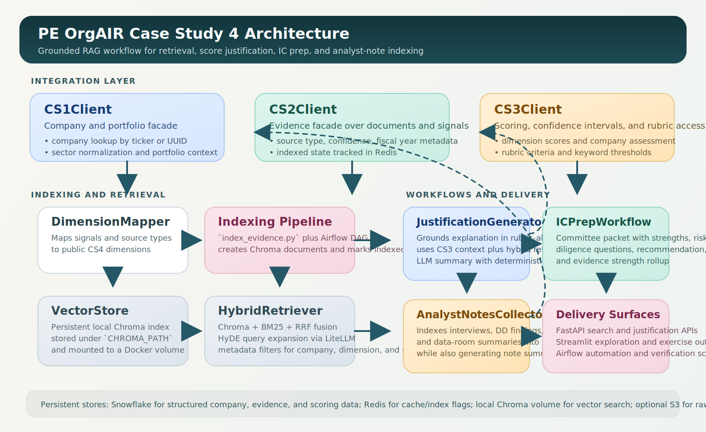
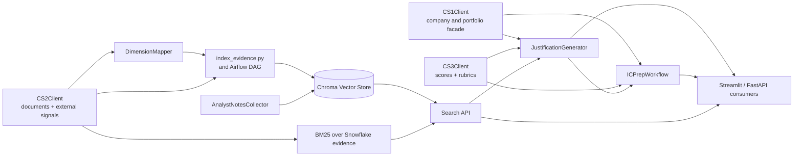

# CS4 Architecture

## Component Diagram

## Retrieval Path

1. `CS2Client` reads document chunks and external signals from Snowflake.
2. `DimensionMapper` assigns public CS4 dimensions and signal weights.
3. `scripts/index_evidence.py` converts evidence into Chroma documents and marks indexed records in Redis.
4. `HybridRetriever` fuses Chroma semantic search with BM25 lexical search using reciprocal rank fusion.
5. `HyDEGenerator` optionally expands the query through LiteLLM and falls back to deterministic expansion if credentials are unavailable.

## Justification Path

1. `ScoringClient` loads the latest company scoring payload.
2. `CS3Client` exposes dimension scores, confidence intervals, and rubric criteria in the assignment-facing schema.
3. `JustificationGenerator` retrieves evidence, aligns it to rubric keywords, and produces a grounded summary with citations.

## Workflow Extensions

- `ICPrepWorkflow` rolls dimension justifications into a committee packet with strengths, risks, diligence questions, and recommendation.
- `AnalystNotesCollector` now supports both generated notes and indexed submissions for interviews, DD findings, and data-room summaries.
- `dags/index_evidence.py` provides the nightly indexing pipeline required by the case study extension.
