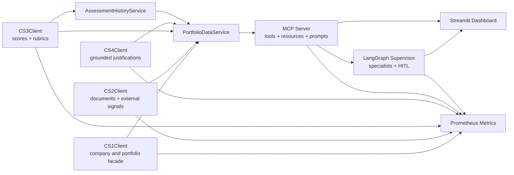

# CS5 Architecture

## Component Diagram

## Data And Retrieval Path

1. `CS1Client` resolves company and portfolio context from the platform store.
2. `CS2Client` loads evidence from Snowflake-backed documents and external signals.
3. `scripts/index_evidence.py` pushes evidence into Chroma for semantic search.
4. `HybridRetriever` fuses vector search and BM25 lexical search.
5. `JustificationGenerator` combines retrieved evidence with CS3 scoring context to produce grounded justifications.

## MCP Path

1. `app/mcp/server.py` registers six CS5 tools:
   - `calculate_org_air_score`
   - `get_company_evidence`
   - `generate_justification`
   - `project_ebitda_impact`
   - `run_gap_analysis`
   - `get_portfolio_summary`
2. `app/mcp/resources.py` exposes reusable scoring and sector resources.
3. `app/mcp/prompts.py` exposes reusable due-diligence and IC-prep prompts.
4. `app/mcp/client.py` connects over Streamable HTTP or falls back to stdio for local execution.

## Agentic Workflow Path

1. `app/agents/state.py` defines the LangGraph workflow state.
2. `app/agents/specialists.py` contains the SEC, talent, scoring, evidence, and value-creation agents.
3. `app/agents/supervisor.py` routes work across specialists and triggers HITL approval for:
   - Org-AI-R scores below `40`
   - Org-AI-R scores above `85`
   - EBITDA projections above `5%`
4. `exercises/agentic_due_diligence.py` is the coursework entrypoint for the end-to-end CS5 workflow.

## Observability

- `app/services/observability/metrics.py` tracks MCP tool calls, agent invocations, HITL approvals, and CS client calls.
- `app/main.py` exposes `/metrics` for the FastAPI app.
- `app/mcp/asgi.py` exposes `/metrics` alongside the Streamable HTTP MCP endpoint.

## Persistence Notes

- `assessment_history_snapshots` stores point-in-time scoring snapshots for trend analysis.
- `PortfolioDataService` now reads entry scores from persisted history rather than returning a hardcoded fallback.
- `CS4Client` is initialized lazily inside the portfolio service to avoid eager model-loading side effects during import.
