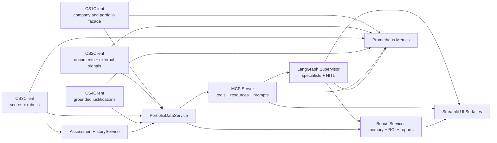

# CS5 Architecture

## Component Diagram

## Data And Retrieval Path

1. `CS1Client` resolves company and portfolio context from the platform store.
2. `CS1Client` prefers persisted `portfolios` and `portfolio_holdings` rows for portfolio membership and enterprise value.
3. When persisted holdings are absent, the CS1 facade can read `CS1_PORTFOLIOS_JSON` and then fall back to configured portfolio tickers for local execution.
4. `CS2Client` loads evidence from Snowflake-backed documents and external signals.
5. `scripts/index_evidence.py` pushes evidence into Chroma for semantic search.
6. `HybridRetriever` fuses vector search and BM25 lexical search.
7. `JustificationGenerator` combines retrieved evidence with CS3 scoring context to produce grounded justifications.

## MCP Path

1. `app/mcp/server.py` registers the six core CS5 tools plus bonus tools for:
   - `calculate_org_air_score`
   - `get_company_evidence`
   - `generate_justification`
   - `project_ebitda_impact`
   - `run_gap_analysis`
   - `get_portfolio_summary`
   - `remember_company_memory`
   - `recall_company_memory`
   - `record_investment_roi`
   - `get_investment_tracker_summary`
   - `generate_ic_memo`
   - `generate_lp_letter`
2. `app/mcp/resources.py` exposes reusable scoring and sector resources.
3. `app/mcp/prompts.py` exposes reusable due-diligence, IC-prep, and LP-update prompts.
4. `app/services/value_creation.py` supplies the shared v2.0 EBITDA projection and gap-analysis logic used by the MCP tools.
5. `app/mcp/client.py` connects over Streamable HTTP or falls back to stdio for local execution.

## Agentic Workflow Path

1. `app/agents/state.py` defines the LangGraph workflow state.
2. `app/agents/specialists.py` contains the SEC, talent, scoring, evidence, and value-creation agents.
3. `app/agents/supervisor.py` routes work across specialists and triggers HITL approval for:
   - Org-AI-R scores below `40`
   - Org-AI-R scores above `85`
   - EBITDA projections above `5%`
4. Completed due-diligence runs are persisted into the bonus semantic-memory store for later recall in IC memos and LP letters.
5. `exercises/agentic_due_diligence.py` is the coursework entrypoint for the end-to-end CS5 workflow.

## Bonus Extensions

- `app/services/extensions/mem0_memory.py` provides a local Mem0-style semantic memory store for diligence and portfolio notes.
- `app/services/extensions/investment_tracker.py` tracks active AI value-creation programs and computes ROI / MOIC.
- `app/services/extensions/report_generators.py` generates:
  - IC memos as Markdown and Word artifacts
  - LP letters as Markdown and Word artifacts
- `app/bonus_facade.py` exposes these services to the unified Streamlit UI and the MCP layer.
- `results/bonus/` is the shared artifact root for memory, ROI tracking, and exported documents.

## UI Surfaces

- `streamlit/app.py` is the single Streamlit entrypoint for the repository and embeds the full `CS5 Dashboard` as its own tab.
- `app/dashboard/view.py` contains the shared CS5 dashboard renderer used by the main platform UI.
- The embedded dashboard includes dedicated sections for:
  - Mem0 semantic memory
  - investment tracker with ROI
  - IC memo generation
  - LP letter generation

## Observability

- `app/services/observability/metrics.py` tracks MCP tool calls, agent invocations, HITL approvals, and CS client calls.
- `app/main.py` exposes `/metrics` for the FastAPI app.
- `app/mcp/asgi.py` exposes `/metrics` alongside the Streamable HTTP MCP endpoint.

## Persistence Notes

- `assessment_history_snapshots` stores point-in-time scoring snapshots for trend analysis.
- `portfolios` and `portfolio_holdings` provide explicit portfolio membership and enterprise values for Fund-AI-R.
- `PortfolioDataService` now reads entry scores from persisted history rather than returning a hardcoded fallback.
- `PortfolioDataService` also carries enterprise-value metadata so portfolio summary and dashboard metrics are EV-weighted.
- `CS4Client` is initialized lazily inside the portfolio service to avoid eager model-loading side effects during import.
